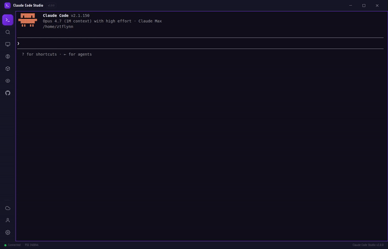

# Catalyst UI

> **Formerly Claude Code Studio.**  Multi-vendor AI workbench in a single
> desktop app.  Embedded terminal for Claude Code, plus integrated panels
> for Hugging Face model discovery, Ollama local models, multi-provider
> API keys (OpenAI / Gemini / OpenRouter), resource monitoring, GitHub,
> compact optimization, cost tracking, accessibility, and cloud sync.

[](./LICENSE)
[](https://github.com/LxveAce/catalyst-ui/releases/latest)


<p align="center">
  
</p>

> Provided **as is**, without warranty; you use it at your own risk. See [DISCLAIMER.md](DISCLAIMER.md).

<!-- STATUS-ROADMAP:START -->
## Status & Roadmap

**Status:** v4.0.3 — healthy and actively releasing, with green CI/release pipelines.

**In progress / known issues:**
- v4.1.0 release cut in progress — terminal-profiles and Catalyst Brain work is on `master`, pending tagging/release.
- macOS auto-update reliability fix in progress (Windows and Linux installers are unaffected).
- macOS builds are currently unsigned; code signing + notarization are planned (see Roadmap).

**Roadmap:**
- Ship the v4.1.0 release (terminal-profiles + Catalyst Brain).
- Per-provider API key management UI.
- macOS code signing + notarization (pairs with the auto-update fix).
- Model comparison view.
- Embedding / RAG over sessions (largely realized via Catalyst Brain — reconcile and round out).
- Per-model VRAM tracking.
<!-- STATUS-ROADMAP:END -->

---

## Quick install

Download from the [**latest release**](https://github.com/LxveAce/catalyst-ui/releases/latest)
and double-click. The installer downloads Node + the Claude CLI for you and
launches the app — sign in to Claude in the first-launch modal, done.

- **Windows:** `Catalyst-UI-4.0.3-Windows.exe` (NSIS installer)
- **macOS Apple Silicon:** `Catalyst-UI-4.0.3-Mac.dmg` (drag to Applications)
- **Linux:** `Catalyst-UI-4.0.3-Linux-Universal.AppImage` (portable),
  `-Linux-Debian.deb` (Debian/Ubuntu), or `-Linux-Fedora.rpm` (Fedora/RHEL)

Per-platform install details, SmartScreen/Gatekeeper workarounds, and the
build-from-source instructions are in [Installing](#installing) below.

> Upgrading from Claude Code Studio v3.x? It's an in-place upgrade — all your
> settings carry over. See [`docs/MIGRATING_FROM_CCS.md`](./docs/MIGRATING_FROM_CCS.md).

---

## Overview

Catalyst UI embeds the Claude Code CLI in a polished Electron desktop app,
alongside an integrated Hugging Face Hub browser, Ollama model bridge, and
an Obsidian-compatible knowledge layer.  The core is a genuine terminal
(node-pty + xterm.js) running `claude` — the sidebar adds tooling around it
without getting in the way of the terminal-first workflow.

## Features

### Terminal & CLI

- **Embedded terminal** — real PTY running `claude`, with a
  Windows-Terminal-style **tab strip** and session persistence. `+`
  opens a profile picker (Claude / Claude skip-permissions / Ollama / Aider /
  Gemini / system shells); tabs pop out into their own windows.
- **Claude (Chat) profile** — runs Claude in non-interactive stream-json
  mode rendered as a structured chat (text / tool-use / tool-result / thinking
  blocks) via the chat skin overlay.
- **Shell profiles** — launch any detected system shell (PowerShell, Bash,
  Git Bash, WSL, Zsh, Fish) as a terminal tab alongside Claude.

### Model Management

- **Multi-model catalog** — a curated catalog of **41 models** (6 API +
  35 local: Qwen, DeepSeek, Llama, Gemma, Granite, Phi, Mistral,
  embeddings, and more). Hardware-tier auto-detect, cwd-aware
  recommendations (frontend vs backend), in-panel terminal + pop-out
  windows for launched models, and a first-run picker that pre-pulls your
  hardware's defaults. Vetting notes live in
  [`docs/MULTI_MODEL.md`](./docs/MULTI_MODEL.md).
- **Hugging Face Hub browser** — Browse / Cached / Research sub-tabs: live
  Hub search with hardware-aware GGUF fit badges, a one-click **GGUF →
  Ollama import & launch** bridge, direct GGUF downloads with progress,
  chat template viewer, and a disclaimer-gated Research catalog with audit log.
- **Ollama bridge** — detect, pull, delete, start/stop/restart the daemon.
  Pull progress streams in real-time with cancel support.
- **Blind model compare** — select 2–4 Ollama models, enter a prompt, and
  see responses side-by-side. Blind mode hides model names for unbiased
  evaluation; reveal when ready.

### Knowledge & Productivity

- **Catalyst Brain** — Obsidian-compatible `.md` knowledge folder. Read, edit
  (with diff-before-write preview), create, and delete notes with YAML
  frontmatter + `[[wikilinks]]` preserved. Includes RAG semantic search
  (Ollama embeddings), wikilink graph with backlinks, `obsidian://` URI
  interop, and Canvas/Bases file support.
- **Notes** — quick-capture notes with markdown rendering, tags, search,
  pinning, and sort. Stored locally in your user data directory.
- **LMM journaling** — in-app Lincoln Manifold Method workflow
  (RAW → NODES → REFLECT → SYNTHESIZE).
- **Snippets** — persistent text snippets insertable via the command palette.

### DevOps & Monitoring

- **GitHub integration** — repos, commits, branches, PRs, and issues; PAT
  stored encrypted via Electron `safeStorage`.
- **Resource monitor** — live CPU / RAM / GPU gauges, with CPU and RAM also
  split by process bucket (Claude PTYs, model PTYs, Ollama daemon). GPU is
  reported system-wide.
- **Token cost tracker** — per-session input/output token estimates with
  daily budgets and 30–90 day rolling history.
- **Compact controller** — reads/toggles the compact-controller hooks and
  session state.

### Customization & UX

- **Theming** — dark base with 13 built-in accent presets (Purple, Blue,
  Emerald, Rose, Amber, Cyan, Slate, Indigo, Crimson, Forest, Magenta,
  Midnight, Solarized) plus custom theme creation via hex color picker.
- **Background patterns** — optional animated canvas backgrounds (dots,
  grid, digital rain, particles) with adjustable intensity.
- **Layout density** — compact, comfortable, or spacious spacing presets.
- **Font selection** — system, monospace, Inter, or Fira Code.
- **Frosted glass** — optional backdrop-filter blur on panels.
- **Accessibility** — 10 toggles: high-contrast, font scale, reduce motion,
  color-blind palettes (protanopia / deuteranopia / tritanopia), large focus
  ring, 44px targets, dyslexia font, screen reader mode, keyboard hints.
- **Resizable right panel** — 420px default, drag to resize (280–800),
  double-click to reset; persisted across restarts.
- **Keyboard shortcuts overlay** — press `?` to see all keybindings.
- **Toast notifications** — in-app event notifications for sync errors,
  budget alerts, update availability, and PTY exits.
- **Command palette** — fuzzy search across panels, themes, snippets,
  terminal actions. `Ctrl+Shift+P` / `Cmd+Shift+P`.
- **Rebindable hotkeys** — customize key chords for all actions.
- **System tray** — minimize to tray on close.
- **Incognito tabs** — open ephemeral Claude sessions via the profile
  picker or command palette; not persisted across restarts.
- **Command palette history** — press arrow-up on an empty palette input
  to recall previously executed commands.
- **Escape menu stack** — overlays dismiss in LIFO order; pressing
  Escape always closes the topmost overlay first.

### Cloud & Sync

- **Auth + settings sync** — optional account with cross-device settings sync.
- **Vault sync** — push compact-controller vaults to a private GitHub repo
  with append-only upload and per-file backoff.
- **Multi-provider API keys** — universal key store for Anthropic, OpenAI,
  Gemini, and OpenRouter. Encrypted via `safeStorage` (DPAPI on Windows,
  Keychain on macOS, libsecret on Linux).

### Platform

- **Auto-updater** — stable and beta channels via GitHub Releases (Windows & Linux; macOS auto-update is currently disabled pending code-signing — see Status).
- **Cross-platform** — Windows (NSIS), macOS (DMG), Linux (AppImage/deb/rpm).
- **First-run bootstrap** — installs Node + Claude CLI automatically.
- **`--dangerously-skip-permissions` toggle** — Settings → Claude CLI.
  Auto-injects the flag when spawning Claude; off by default.

## Platform support

Catalyst UI ships on **Windows**, **macOS** (Apple Silicon), and **Linux**
(AppImage / .deb / .rpm). All three include the same bootstrap that
installs Node + the Claude CLI for you — no manual prereqs.

Upgrading from Claude Code Studio v3.x is an in-place upgrade (settings carry
over) — see [`docs/MIGRATING_FROM_CCS.md`](./docs/MIGRATING_FROM_CCS.md). v1.0
was Windows-only via Squirrel.Windows; v1.0 users see
[`docs/MIGRATING_FROM_V1.md`](./docs/MIGRATING_FROM_V1.md) for the one-time
uninstall + reinstall path.

## Installing

Download the right asset for your OS from the
[latest release](https://github.com/LxveAce/catalyst-ui/releases/latest)
and follow the per-platform steps below.

### Windows

1. Download `Catalyst-UI-4.0.3-Windows.exe`.
2. Run it and follow the NSIS installer (you can choose the install
   directory). It downloads Node + the Claude CLI, then launches Catalyst
   UI. ~30 seconds total. No further setup needed.

**SmartScreen warning** (first install, until code-signing is added in
a future release):
- Click "More info" → "Run anyway".
- Appears once per machine; subsequent launches are clean.

### macOS (Apple Silicon, Intel via Rosetta)

1. Download `Catalyst-UI-4.0.3-Mac.dmg` (Apple Silicon native;
   runs on Intel Macs via Rosetta).
2. Open the DMG, drag **Catalyst UI** into **Applications**.
3. Eject the DMG, open Catalyst UI from Launchpad / Spotlight.
4. First launch: an onboarding modal downloads Node + the Claude CLI
   into `~/Library/Application Support/Claude Code Studio/runtime/`.
   Click **Sign in to Claude** — the in-session `/login` command opens
   your browser to complete OAuth.

**Gatekeeper warning** (first launch, until notarization is added in a
future release):
- macOS may say *"Catalyst UI cannot be opened because the
  developer cannot be verified."*
- Right-click the app icon → **Open** → confirm in the dialog. Required
  only once.

**Apple Silicon vs Intel:** use the arm64 build on M-series chips for
better performance. It also runs on Intel Macs through Rosetta, but
native is faster.

### Linux

Three install formats are published per release. Pick whichever matches
your distro.

#### AppImage (works on any distro, no install needed)

1. Download `Catalyst-UI-4.0.3-Linux-Universal.AppImage`.
2. Make it executable and run:
   ```bash
   chmod +x Catalyst-UI-4.0.3-Linux-Universal.AppImage
   ./Catalyst-UI-4.0.3-Linux-Universal.AppImage
   ```
3. First launch: onboarding modal downloads Node + Claude CLI into
   `~/.config/Claude Code Studio/runtime/`. Sign in via the modal.

If you want a desktop entry + menu integration, drop the AppImage into
`~/Applications/` and use [AppImageLauncher](https://github.com/TheAssassin/AppImageLauncher).

#### Debian / Ubuntu

```bash
wget https://github.com/LxveAce/catalyst-ui/releases/latest/download/Catalyst-UI-4.0.3-Linux-Debian.deb
sudo dpkg -i Catalyst-UI-4.0.3-Linux-Debian.deb
sudo apt-get install -f   # resolve missing deps if any
```

Launch from your applications menu. First-launch bootstrap is the same
modal as the AppImage.

#### Fedora / RHEL / CentOS

```bash
wget https://github.com/LxveAce/catalyst-ui/releases/latest/download/Catalyst-UI-4.0.3-Linux-Fedora.rpm
sudo dnf install ./Catalyst-UI-4.0.3-Linux-Fedora.rpm
```

(Or `sudo rpm -i` if you prefer rpm directly.)

**Linux node-pty native build:** the prebuild that ships with node-pty
covers `linux-x64` with glibc 2.17+. If you're on a very old distro
(CentOS 7 era) and the embedded terminal won't spawn, that's the issue
— file an issue with `ldd --version` output.

### All platforms: what the first launch does

Every install path ends at the same first-launch flow:

1. Catalyst UI checks for an existing Claude CLI on PATH or bundled runtime.
2. If missing: onboarding modal shows **Install Claude CLI** button.
   Click → modal streams the install log → ~30-60 seconds → done.
3. If unauthenticated: modal shows **Sign in to Claude**. Click →
   `/login` is sent to the running Claude session in the embedded
   terminal → Claude opens your browser → complete OAuth → modal
   dismisses.
4. Subsequent launches skip the modal entirely (unless the CLI is
   broken or `~/.claude.json` is gone).

## Building from source

### Developer prerequisites

- **Node.js `>=22.0.0 <24.0.0`** — Node 22 LTS is required; `package.json`
  pins `engines.node` to this range. Windows users: see
  [`CONTRIBUTING.md`](./CONTRIBUTING.md#node-22-on-windows).
- **For node-pty native build on Windows:** Visual Studio Build Tools 2022
  with the C++ workload, plus the Windows 10/11 SDK (10.0.22621+).
- **For `npm run dist` (NSIS installer build, Windows-only):** Windows
  Developer Mode enabled (Settings → Privacy & Security → For
  Developers). Without it, the 7za extraction of electron-builder's
  `winCodeSign` archive fails on macOS dylib symlinks.

### Getting started

```bash
git clone https://github.com/LxveAce/catalyst-ui.git
cd catalyst-ui
npm install            # runs the node-pty patch postinstall
npm start              # dev: Vite + Electron with HMR
```

### Build outputs

The build pipeline is electron-builder with per-OS targets.

```bash
# Cross-platform
npm run dist:dir            # unpacked output under dist/ — quick smoke test
npm run vite:build          # just the renderer/main bundles

# Per-OS local builds
npm run dist                # Windows NSIS installer (needs Dev Mode)
npm run dist:mac            # macOS DMG (must run ON a Mac)
npm run dist:linux          # Linux AppImage + deb + rpm

# Build all 3 targets
npm run dist:all

# Publish to GitHub Releases
npm run dist:publish        # Windows
npm run dist:publish:mac    # macOS
npm run dist:publish:linux  # Linux
```

> All pipelines need Node 22 — see [Developer prerequisites](#developer-prerequisites).

## Tech stack

Electron 42 · React 19 · Vite · TypeScript 6.0 · node-pty · xterm.js ·
systeminformation · Octokit · @huggingface/hub · electron-builder

## Project structure

```
src/
  main/       Electron main process — backend services (PTY, models,
              GitHub, Brain, sync, resource monitor, ...)
  preload/    Preload script (IPC bridge to renderer)
  renderer/   React 19 UI (App.tsx + sidebar panel modules)
  shared/     TypeScript types + IPC channel definitions
scripts/      Build helpers (node-pty patch, Vite build, runtime verify)
docs/         Documentation, release notes, migration guides
build/        Installer assets (NSIS script, branding BMPs)
obsidian-plugin/  Companion Obsidian plugin for vault interop
```

## Documentation

- [`CHANGELOG.md`](./CHANGELOG.md) — per-release history
- [`docs/MULTI_MODEL.md`](./docs/MULTI_MODEL.md) — multi-model catalog & vetting notes
- [`docs/MIGRATING_FROM_CCS.md`](./docs/MIGRATING_FROM_CCS.md) — Claude Code Studio → Catalyst UI rebrand & upgrade
- [`docs/MIGRATING_FROM_V1.md`](./docs/MIGRATING_FROM_V1.md) — v1.0 (Squirrel) → NSIS reinstall path
- [`docs/BACKLOG.md`](./docs/BACKLOG.md) — open ideas & known bugs
- [`docs/HANDOFF.md`](./docs/HANDOFF.md) — historical v1→v3 phased development plan
- Per-release notes: [`docs/RELEASE_NOTES_v4.0.0.md`](./docs/RELEASE_NOTES_v4.0.0.md) and earlier

## Contributing

Contributions are welcome — see [`CONTRIBUTING.md`](./CONTRIBUTING.md).

## Security

To report a vulnerability, see [`SECURITY.md`](./SECURITY.md).

## License

[MIT](./LICENSE) © LxveAce

## Connect

- **Discord:** [discord.gg/lxveace](https://discord.gg/lxveace) — questions, help, or to talk through this project
- **GitHub:** [@LxveAce](https://github.com/LxveAce)
- **Website:** [lxveace.com](https://lxveace.com)
